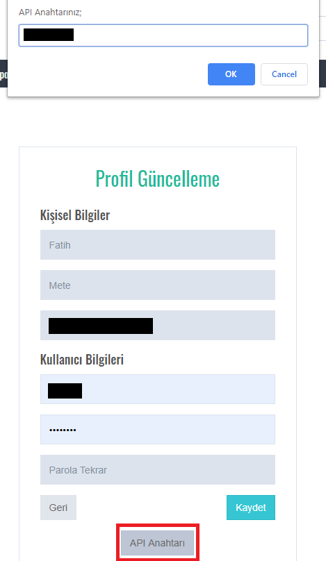

# EVDS

[English](https://github.com/fatihmete/evds/blob/master/README_EN.md)

EVDS paketi EVDS-API üzerinden Türkiye Cumhuriyet Merkez Bankası (TCMB) tarafından Elektronik Veri Dağıtım Sistemi (EVDS) aracılığıyla yayımlanan tüm istatistiki verilere python aracılığıyla erişmenize imkan sağlar.

EVDS paketi resmi bir paket olmayıp açık kaynak kodlu (MIT lisansıyla) olarak geliştirilmektedir.

## Kurulum

evds paketini pip paket yöneticisi aracılığıyla kurabilirsiniz:

```
pip install evds --upgrade
```

## Yenilikler

0.3 sürümü ile aşağıdaki değişiklikler yapıldı:

1. SSL hatalarının giderilmesi için legacySSL parametresi eklendi. [PR #8](https://github.com/fatihmete/evds/pull/8)
2. Kod içerisinde düzeltmeler yapıldı. [PR #6](https://github.com/fatihmete/evds/pull/6)
3. Pandas DataFrame numeric tiplere cast ederken ortaya çıkan FutureWarning uyarıları kapatıldı. Bu hata sonraki sürümlerde giderilecektir.

0.2 sürümü ile birlikte aşağıdaki özellikler eklenmiştir:

1. `get_data`, `get_sub_categories` ve `get_series` fonksiyonlarına, `raw` parametresi eklendi. Bu parametre `True` olarak tanımlandığında ilgili verilere dictionary formatında erişebilirsiniz.
2. Çeşitli hatalar giderildi.

0.1.1 sürümü ile birlikte aşağıdaki özellikler eklenmiştir:

1. formulas parametresindeki hata giderildi.

0.1.0 sürümü ile birlikte aşağıdaki özellikler eklenmiştir:

1. API üzerinden erişilemeyen serilere ilişkin EVDS'de yapılan güncellemeye paralel olarak tüm serilere erişim olanağı sağlanmıştır.
2. Proxy desteği eklenmiştir.
3. Küçük hatalar giderildi

## Kullanım

Örnek kullanım, 01-01-2019 - 01-01-2020 arası USD ve EUR alış kurlarına aşağıdaki şekilde erişilebilir.

```python
from evds import evdsAPI
evds = evdsAPI('EVDS_API_ANAHTARI')
evds.get_data(['TP.DK.USD.A.YTL','TP.DK.EUR.A.YTL'], startdate="01-01-2019", enddate="01-01-2020")
```

get_data fonksiyonu DataFrame return edecektir. İstenmesi halinde `raw=True` parametresi ile dictionary formatında ham veriye ulaşılabilir.

### API Anahtarı Alma

evds paketini kullanmak için öncelikle EVDS sistemi üzerinden API Anahtarı almanız gerekmektedir. API Anahtarı almak için aşağıdaki adımları izleyiniz:

1. [EVDS](https://evds2.tcmb.gov.tr/) sayfasına giriş yaptıktan sonra Giriş Yap ve Kayıt Ol bağlantılarını izleyerek bir EVDS hesabı oluşturun.
2. Ardından kullanıcı adınızın altında yer alan profil bağlantısına tıklayınız.


3. Profil sayfanızın alt kısmında yer alan "API Anahtarı" butonuna tıklayınız ve açılan kutucukta yer alan değeri kopyalayınız.



### Detaylı Sorgulama

`get_data` fonksiyonu aşağıdaki parametreleri alır:

#### series

Bu parametre liste olarak tanımlanmalıdır. Ayrıca birden fazla seri bu liste içerisinde tanımlanabilir. Tanımlanması zorunludur.

#### startdate

Seride yer alan verilerin hangi tarihten itibaren seçileceği bu parametre ile belirlenir. Tanımlanması zorunludur.

#### enddate

Eğer seri üzerinde bir aralık seçimi yapılmak isteniyorsa aralığın bitiş tarihi bu parametre ile belirtilir. Tanımlanması ihtiyaridir. Tanımlanmadığı durumda `startdate` değerine eşit olarak tanımlanır.

#### raw

`True` olması halinde fonksiyon talep edilen veriyi DataFrame yerine dictionary return eder.
Örnek kullanım:

```python
...
evds.get_data(['TP.DK.USD.A.YTL','TP.DK.EUR.A.YTL'], startdate="01-01-2019", enddate="01-01-2020", raw=True)
```

#### aggregation_types

Seri içindeki verilerin getirilmesi esnasında kullanılacak olan toplululaştırma yöntemini ifade eder. Tanımlanması ihtiyaridir. Eğer tanımlanmamışsa seri için tanımlanan öntanımlı yöntem kullanılır. Ayrıca değer olarak string veya liste alabilir. String alması durumunda tüm seriler için aynı yöntem uygulanır. Liste olarak tanımlanırsa `series` parametresinde tanımlanan serilere sırasıyla belirtilen yöntemler uygulanır.
Kullanılabilecek yöntemler aşağıdaki gibidir:

| Yöntem    | Parametre Değeri |
| --------- | ---------------- |
| Ortalama  | avg              |
| En düşük  | min              |
| En yüksek | max              |
| Başlangıç | first            |
| Bitiş     | last             |
| Kümülatif | sum              |

#### formulas

Seri içindeki verilerin getirilmesi esnasında uygulanacak formülü ifade eder. Tanımlanması ihtiyaridir. Eğer tanımlanmamışsa seri için tanımlanan öntanımlı formül kullanılır. Ayrıca değer olarak string veya liste alabilir. String alması durumunda tüm seriler için aynı formül uygulanır. Liste olarak tanımlanırsa `series` parametresinde tanımlanan serilere sırasıyla belirtilen formüller uygulanır.
Kullanılabilecek yöntemler aşağıdaki gibidir:

| Formül                                     | Değer |
| ------------------------------------------ | ----- |
| Düzey (Öntanımlı)                          | 0     |
| Yüzde Değişim                              | 1     |
| Fark                                       | 2     |
| Yıllık Yüzde Değişim                       | 3     |
| Yıllık Fark                                | 4     |
| Bir Önceki Yılın Sonuna Göre Yüzde Değişim | 5     |
| Bir Önceki Yılın Sonuna Göre Fark          | 6     |
| Hareketli Ortalama                         | 7     |
| Hareketli Toplam                           | 8     |

API formula parametresi uygulandığında orijinal değerleri `None` olarak yanıtladığı için, formula parametresi tanımladığınız serinin orijinal değerlere ulaşmak için aynı seriyi tekrar ekleyiniz ve formula parametresini 0 olarak tanımlayınız. Örneğin

```python
evds.get_data(['TP.DK.USD.A.YTL','TP.DK.USD.A.YTL'],
              startdate="01-01-2019",
              enddate="01-01-2020",
              formulas=[1,0],
                )
```

USD için yüzde değişim ve orijinal değerlere aynı anda yukarıdaki gibi ulaşabilirsiniz.

#### frequency

Seri içerisinde yer alan verilerin hangi sıklıkla getireceğini ifade eder. Tanımlanması ihtiyaridir. Eğer tanımlanmamışsa seri için tanımlanan öntanımlı yayımlanma sıklığı kullanılır.Aşağıdaki değerleri alabilir.

| Sıklık     | Değer |
| ---------- | ----- |
| Günlük     | 1     |
| İşgünü     | 2     |
| Haftalık   | 3     |
| Ayda 2 Kez | 4     |
| Aylık      | 5     |
| 3 Aylık    | 6     |
| 6 Aylık    | 7     |
| Yıllık     | 8     |

## Mevcut Serileri Listeleme

EVDS üzerinde veri serileri sırasıyla Ana Kategori, Alt Kategori ve Seri hiyerarşisinde sunulmaktadır.

> `get_data` fonksiyonun kullanılması için aşağıda yer alan işlemlerin gerçekleştirilmesine gerek yoktur. Veri serisine ait kodun bilinmesi durumunda doğrudan `get_data` fonksiyonu kullanılabilir.

### Ana kategorileri listeleme

`main_categories` değişkeni ile ana kategorileri listeleyebilirsiniz.

```python
...
evds.main_categories
```

komut ile ana kategorileri listeleyebilirsiniz.

| CATEGORY_ID | TOPIC_TITLE_TR               |
| ----------- | ---------------------------- |
| 1           | PİYASA VERİLERİ              |
| 2           | KURLAR                       |
| 3           | FAİZ İSTATİSTİKLERİ          |
| 4           | PARA VE BANKA İSTATİSTİKLERİ |
| ...         | ...                          |

### Alt kategorileri listeleme

Ana kategori altında yer alan alt kategorilere aşağıdaki şekilde ulaşabilirsiniz. Ayrıca `raw=True` parametresi ile DataFrame yerine dictionary formatında alt kategorileri ulaşılabilir.

```python
evds.get_sub_categories('Ana kategori ID'si veya Adı')
```

Örnek kulllanım;

```python
...
evds.get_sub_categories(6)
```

| CATEGORY_ID | DATAGROUP_CODE | DATAGROUP_NAME                                    |
| ----------- | -------------- | ------------------------------------------------- |
| 6           | bie_dbafod     | Dış Borç Anapara ve Faiz Ödemeleri ile Diğer T... |
| 6           | bie_dbdborc    | Dış Borçlar-Brüt (Hazine ve Maliye Bakanlığı)     |
| 6           | bie_kvdbs      | Kısa Vadeli Dış Borç Stoku (milyon ABD doları)    |
| 6           | bie_yssk       | Özel Sektörün Yurt Dışından Sağladığı Uzun Vad... |

Yukarıda yer alan örnekte 6'nolu kategori altında yer alan alt kategoriler listelenmiştir. Ayrıca `get_sub_categories` fonksiyonunda CATEGORY_ID yerine doğrudan ana kategori adı ile kullanabilirsiniz. Örneğin

```python
...
evds.get_sub_categories("KURLAR")
```

### Serileri listeleme

Alt kategori altında yer alan veri serilerine aşağıdaki şekilde ulaşabilirsiniz. Ayrıca `raw=True` parametresi ile DataFrame yerine dictionary formatında serilere ulaşılabilir.

```python
evds.get_series('Alt kategori adı')
```

Örnek kulllanım;

```
...
evds.get_series('bie_dbdborc')
```

| SERIE_CODE | SERIE_NAME                            | START_DATE |
| ---------- | ------------------------------------- | ---------- |
| TP.DB.B01  | 1:TÜRKİYE BRÜT DIŞ BORÇ STOKU         | 01-10-1989 |
| TP.DB.B02  | 2:KISA VADELİ BORÇLAR (Borçluya Göre) | 01-10-1989 |
| TP.DB.B03  | 2A:KAMU (Borçluya Göre)               | 01-10-1989 |
| TP.DB.B04  | 2A1:GENEL YÖNETİM (Borçluya Göre)     | 01-10-1989 |
| TP.DB.B05  | 2A1a:Merkezi Yönetim                  | 01-10-1989 |

`get_data()` fonksiyonu aracılığıyla SERIE_CODE'u kullanarak serilere ait verilere ulaşabilirsiniz.

## Proxy Tanımlama

Proxy adresinizi aşağıdaki gibi `proxies` parametresi ile tanımlayabilirsiniz. Ayrıca `httpsVerify` parametresi ile https kontrolünü devre dışı bırakabilirsiniz.

```
proxies = { "https" : "HTTPS_PROXY_URL"}
evds = evdsAPI('EVDS_API_ANAHTARI', proxies=proxies, httpsVerify=False)
```

## SSLError Hatası çözümü

Sunucu sertifikası ve kullanılan python paketlerinden kaynaklı olarak SSL hatası alınabilmektedir. Bu hata durumunda legacySSL parametresi kullanılabilir:

```
evds = evdsAPI('EVDS_API_ANAHTARI', legacySSL=True)

```
